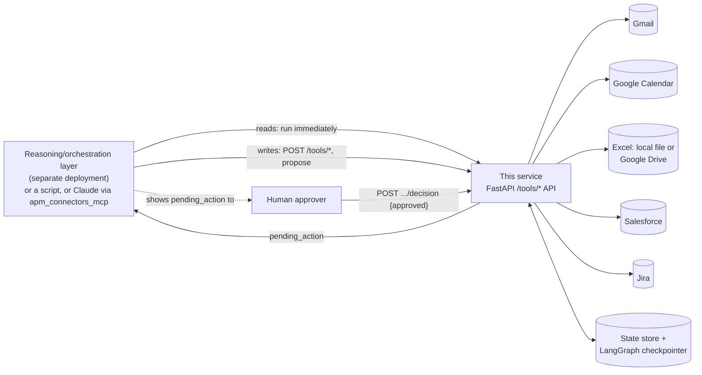
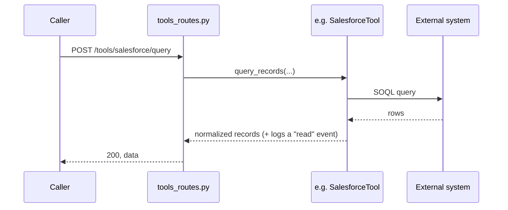
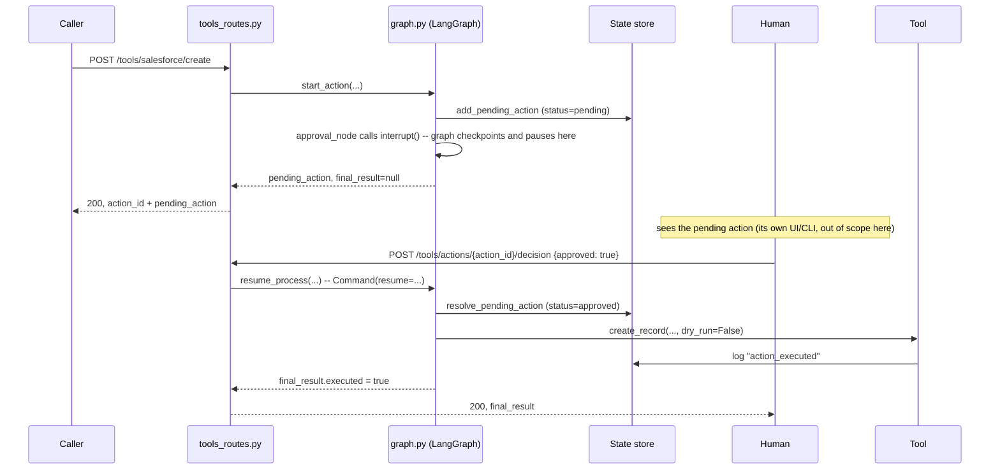
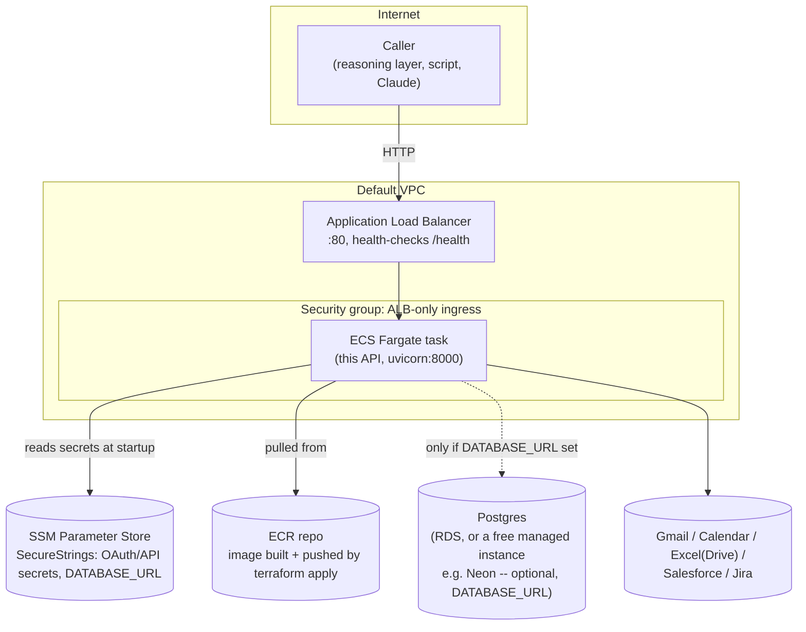

# Architecture

A system-level view of this package: the pieces, how a call moves
through them, and how it's deployed. The other docs are the detailed
references (HTTP contract, per-tool setup, deployment runbook); this
one is the map that ties them together. Start here if you're new to
the repo.

`docs/architecture.pdf` is a 7-page reference built from this same
system: page 1 is a one-page flowchart (every component, the propose/
approve/execute loop, and the pluggable persistence layer in one
picture), page 2 is readable component/connector/persistence reference
tables, and pages 3-7 are a concise deep dive (request flow, the
connector interface, the approval gate, the Postgres-backed
persistence swap, the MCP front door, deployment) — handy to skim,
print, or hand to someone new to the repo. This doc is the
GitHub-native version of the same material, kept in sync with it.

## What this is, in one paragraph

This is the connector/enterprise-systems layer of APM (Agentic Process
Management), extracted so it ships standalone: a plain HTTP API over a
handful of external-system connectors (Gmail, Google Calendar, Excel,
Salesforce, Jira), with a small [LangGraph](https://langchain-ai.github.io/langgraph/)
process in front of every write that makes it physically impossible to
execute without an explicit human decision. It has **no reasoning of
its own** — no free-text entry point, no LLM call anywhere in this
process. A reasoning/orchestration layer (or a script, or an LLM agent
via the bundled MCP server) is a separate deployment that calls this
API and decides *what* to read or write; this package only ever
executes reads, gates writes behind approval, and keeps the audit
trail of everything that happened.

## System context

The caller never talks to Gmail/Salesforce/etc. directly, and never
decides on its own whether a write happens — every arrow into an
external system on the right only fires after the human-approver loop
on the left has returned `approved: true`. See
`docs/security-guardrails.md` for why that's the one rule that never
bends, and `docs/api-contract.md` for the exact HTTP shape of every
call above.

## Components

| Component | Path | Responsibility |
|---|---|---|
| Tool connectors | `src/apm_connectors/tools/*.py` | One module per external system. Each implements the common `BaseTool` interface (`tools/base.py`): declares `capabilities` (`read`/`write`/`action`), and every write/action method takes `dry_run` and logs to the state store. |
| Action graph | `src/apm_connectors/graph.py` | A 3-node LangGraph (`propose → approval → execute`) that gates every write. `approval`'s `interrupt()` is the actual mechanism — the graph physically cannot proceed past it without a `Command(resume=...)` carrying a human decision. |
| State store | `src/apm_connectors/state/store.py`, `state/postgres_store.py` | Process status, the audit log, and pending (proposed-but-undecided) actions. Two interchangeable implementations behind one method surface (`StateStoreProtocol`) — see "Persistence" below. |
| HTTP API | `src/apm_connectors/api/` | `app.py` (FastAPI app + `/health`, `/processes/*`), `tools_routes.py` (one read/write route pair per connector), `dependencies.py` (builds the shared tool instances, state store, and compiled action graph once per process), `schemas.py` (request/response models). |
| MCP server | `src/apm_connectors_mcp/` | Exposes every `/tools/*` route as an MCP tool for an LLM agent host (Claude Desktop/Code). Talks to the HTTP API purely over HTTP (`client.py`) — never imports `apm_connectors.tools`/`graph` directly, so it can be deployed independently of the API itself. |
| Config | `src/apm_connectors/config.py` | Reads environment variables into a `Settings` dataclass. No secrets ever live in this file — see `.env.example`. |

## Request flow

**A read** executes immediately — no approval step, no graph involved:

**A write** never executes on the call that proposes it — this is the
whole point of the action graph:

Between "pauses here" and the decision call, the graph's state lives
in its **checkpointer** — that's what makes resuming possible even in
a different process than the one that started it (see "Persistence"
below). Rejecting instead of approving skips the `Tool` call entirely
and resolves as `{"executed": false, "reason": "rejected"}` — nothing
is ever sent/created/written on a rejection.

## Persistence

Two things need to survive between a write being proposed and a human
deciding on it, and both are pluggable behind the same on/off switch
(`DATABASE_URL`):

| | Default (no `DATABASE_URL`) | With `DATABASE_URL` set |
|---|---|---|
| Status + audit log + pending actions | `StateStore` — a local JSON file (`state/store.py`) | `PostgresStateStore` — same method surface, Postgres tables (`state/postgres_store.py`) |
| LangGraph checkpoint (the graph's paused state itself) | `MemorySaver` — in-process memory | `PostgresSaver` (`langgraph-checkpoint-postgres`) |

Both settings are meant to be turned on together — `api/dependencies.py`
picks one pair or the other based solely on whether `DATABASE_URL` is
set, sharing one `psycopg_pool.ConnectionPool` between the two Postgres
implementations. The default costs zero extra infrastructure (fine for
local dev), but means a process restart loses anything mid-approval;
the Postgres-backed pair survives a restart or a redeploy — the actual
scenario a real deployment needs to handle, live-verified end to end
(propose → replace the ECS task entirely → the pending action and
audit trail are still there on the brand-new task → approve → it
executes). See `docs/running-locally.md` and `docs/deployment.md` for
how to turn it on, including a note on serverless Postgres providers
(Neon, etc.) auto-suspending idle compute, and the connection-health
check (`check=ConnectionPool.check_connection`) that makes both pools
recover from that transparently.

Callers (tools, routes, tests) only ever depend on `StateStoreProtocol`'s
method surface, never on which implementation is behind it — that's
why the swap needed no changes anywhere outside `state/` and
`api/dependencies.py`.

## Deployment topology (AWS ECS on Fargate)

`infra/aws/ecs-fargate/` (Terraform) builds and pushes the image, then
stands up everything above except the Postgres instance itself — that's
provisioned separately (RDS, or an external managed Postgres) and just
wired in via `database_url`. See `docs/deployment.md` for the full
runbook, prerequisites, and per-connector setup. Locally, the same
`Dockerfile` runs directly with `docker run`, no ALB/ECS involved (see
`docs/running-locally.md`).

## Key invariants worth remembering

- **No write executes without an approved `interrupt()` resume.**
  Enforced at two layers: `graph.py`'s `execute_node` is the only place
  any tool's write/action method is ever called with `dry_run=False`;
  every connector's own `require_dry_run_guard` also refuses to treat a
  call as real without that flag. There is no config flag or
  "autonomous mode" that bypasses this — see `docs/security-guardrails.md`.
- **This package has no reasoning of its own.** If a change starts to
  look like "decide what to do," that decision belongs in a separate
  reasoning/orchestration layer calling this API, not here (see
  `CLAUDE.md`).
- **Adding a tool or a route is additive; changing an existing route's
  shape is a breaking change** for whatever's already coded against
  `docs/api-contract.md`.
- **Every implementation swap (state store, checkpointer) happens
  behind an existing method surface/protocol**, not by changing what
  callers depend on — `StateStoreProtocol` is the example so far.

## Where to go next

- `docs/api-contract.md` — the exact HTTP contract every route implements.
- `docs/capability-map.md` — per-connector auth, capabilities, known gaps.
- `docs/security-guardrails.md` — the approval-gate guarantee in detail.
- `docs/running-locally.md` / `docs/deployment.md` — how to actually run this, locally and on AWS.
- `.claude/skills/tool-integration/SKILL.md` — the checklist for adding a new connector.
