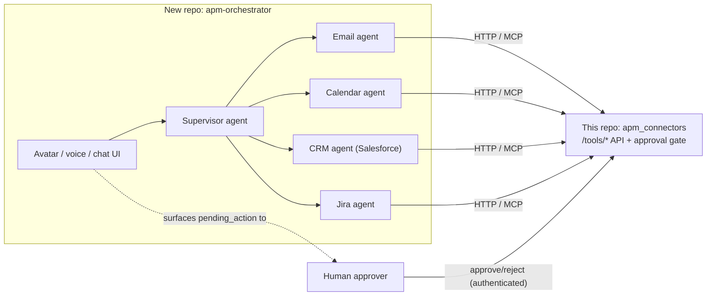

# Roadmap: avatar, multi-agent, scale, security

This repo (connectors + the approval gate) stays as-is: a plain,
auditable HTTP API with no reasoning of its own, per `CLAUDE.md`. This
doc tracks the plan for the layer that sits on top of it — a separate
repo that owns reasoning, orchestration, and the human-facing
interface — plus the production-hardening work that applies to this
repo itself. Nothing here changes this repo's contract; it's the map
of what calls into it next.

## Why a second repo, not four

An avatar (visual/voice interface) and a multi-agent supervisor system
are one presentation layer over one reasoning layer, not two
concerns — the avatar is just the human-facing surface of the
Supervisor agent. They belong in one new repo (call it
`apm-orchestrator` below; naming TBD), separate from this one:

Splitting further later (e.g. avatar streaming media as its own
service) is easy once there's a reason — a shared media/SFU workload
that needs to scale independently of agent logic is the likely trigger.
Don't pre-split before that need shows up.

**The approval boundary never moves.** The avatar/Supervisor can
*propose* and can *display* a pending action to a human, but the
decision that unblocks `execute_node` must still be a real
`POST /tools/actions/{id}/decision` from an authenticated human,
exactly as today. This holds regardless of how sophisticated the
orchestration layer gets — see `docs/security-guardrails.md`.

## Phase 0 — harden this repo's seam first (blocking)

Before any external repo/avatar/real users call this API in
production, close the gap `docs/api-contract.md` already documents:
**"No auth today."**

- Add an API-key or OAuth2 client-credentials check in front of
  `/tools/*` and `/processes/*`.
- Extend the audit log (`StateStoreProtocol`) to record *which*
  authenticated caller proposed an action and *which* authenticated
  human decided it — today it logs the event, not a verified identity.
- Everything below assumes this is done first.

## Phase 1 — multi-agent core (new repo)

- Supervisor agent (Claude Agent SDK) that does intent routing and
  task decomposition.
- Specialized agents, each scoped to one connector domain only (least
  privilege at the agent level, not just OAuth scope): Email, Calendar,
  CRM (Salesforce), Jira, Reporting/Excel.
- Each specialized agent talks to this repo only via
  `apm_connectors_mcp` (or direct HTTP against `/tools/*`) — never
  imports this repo's internals, same boundary this repo already keeps
  with its own MCP server.
- Shared task/conversation state (Postgres) so the Supervisor can track
  multi-step plans across agents.

## Phase 2 — avatar interface (new repo)

- Voice: STT + TTS in front of the Supervisor.
- Visual avatar: start with a lip-synced 2D avatar or a hosted
  talking-head API (e.g. D-ID/Simli) — treat a full 3D/photoreal avatar
  as a later bet, not an MVP requirement.
- Pending-action review surfaced in the same UI, routed to this repo's
  decision endpoint under the authenticated human's own identity
  (Phase 0 dependency).

## Phase 3 — production scalability

**This repo:**
- Turn on the already-built Postgres-backed state store
  (`DATABASE_URL`) in production — not optional once real approvals
  are in flight.
- ECS service auto-scaling (target tracking on CPU/request count) —
  the Postgres-backed checkpointer already makes this safe across
  multiple tasks.
- HTTPS (ACM + domain) in front of the ALB — currently HTTP-only per
  `docs/deployment.md`.
- Per-external-system rate limiting/backpressure (Gmail, Salesforce,
  Jira all have their own quotas this API doesn't currently shield
  itself from).

**New repo:**
- Scale the Supervisor and specialized agents independently (queue-based
  fan-out, e.g. SQS/NATS between them) rather than one monolith process.
- Avatar media/streaming on a managed WebRTC/SFU provider (e.g. LiveKit,
  Daily) rather than self-hosting — this workload scales per concurrent
  session, differently from agent compute.
- Session/turn state in Redis for the avatar's real-time loop.

## Phase 4 — security hardening

- mTLS or OIDC between avatar ↔ Supervisor ↔ this repo's API — no
  layer trusts caller identity by network position alone.
- Prompt-injection defenses at every agent handoff: a specialized
  agent's output is untrusted input to the Supervisor, same as this
  repo already treats a caller's proposed action as needing the
  guardrails in `docs/security-guardrails.md` (e.g. the
  reserved-domain refusal in `GmailTool.send_email`).
- PII/consent policy for voice/video capture and retention.
- Per-tenant/user scoping if more than one business/user shares a
  deployment.
- Independent security review before any real customer data flows
  through the avatar end to end.

## Phase 5 — end-to-end business testing

- Golden-path workflows run against sandbox tenants (a real Gmail test
  account, Salesforce/Jira sandboxes) with real human approvals, not
  just `dry_run=True`.
- Load testing: concurrent avatar sessions, Supervisor fan-out under
  load, this API's throughput against external providers' own rate
  limits.
- Chaos testing: kill an ECS task mid-approval (already live-verified
  for this repo per `docs/deployment.md`), kill a specialized agent
  mid-task, simulate a network partition between the orchestrator and
  this API.
- Pilot UAT with real business users on one full workflow (e.g.
  inbound support email → drafted reply → calendar check → scheduled
  call → CRM update) before wider rollout.

## Rough timeline

Assuming a small team (2-4 engineers) and phases 1-4 overlapping
rather than strictly sequential: **~14-16 weeks (3.5-4 months)** to a
real production v1 across both repos. Phase 0 is a hard blocker and
should land in the first 1-2 weeks.
