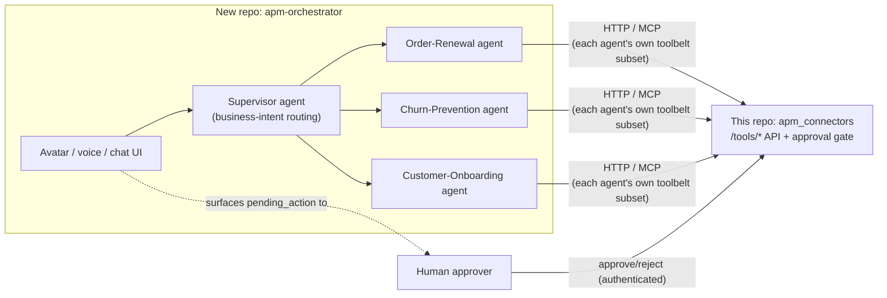

# Roadmap: avatar, multi-agent, scale, security

This repo (connectors + the approval gate) stays as-is: a plain,
auditable HTTP API with no reasoning of its own, per `CLAUDE.md`. This
doc tracks the plan for the layer that sits on top of it — a separate
repo that owns reasoning, orchestration, and the human-facing
interface — plus the production-hardening work that applies to this
repo itself. Nothing here changes this repo's contract; it's the map
of what calls into it next.

## Why a second repo, not four

An avatar (visual/voice interface) and a multi-agent supervisor system
are one presentation layer over one reasoning layer, not two
concerns — the avatar is just the human-facing surface of the
Supervisor agent. They belong in one new repo (call it
`apm-orchestrator` below; naming TBD), separate from this one:

Splitting further later (e.g. avatar streaming media as its own
service) is easy once there's a reason — a shared media/SFU workload
that needs to scale independently of agent logic is the likely trigger.
Don't pre-split before that need shows up.

**Agents are decomposed by business process, not by connector.** The
tempting default is one agent per external system (an "Email agent," a
"Calendar agent"), mirroring this repo's own per-connector modules. Don't
do that — it just relocates the same tool-plumbing without adding
business logic, and pushes all *actual* workflow knowledge (SLA windows,
what blocks a renewal, escalation rules) up into the Supervisor, which
then has to know every business process anyway. Instead, each specialized
agent owns one end-to-end business capability (Order Renewal, Churn
Prevention, Customer Onboarding, ...) and is handed whatever subset of
this repo's connector tools that process actually needs — an
Order-Renewal agent's toolbelt might be `salesforce.query`,
`salesforce.update`, `jira.search` (checking for blocking tickets),
`calendar.create_event`, and `gmail.send`, all called from inside that
one agent's own run, not fanned out across four separate agent hops.
This also makes least-privilege scoping map to something real: "the
Renewals agent can touch Opportunity records and send renewal mail," not
"this agent can call the Salesforce API." New business capabilities get
onboarded as new agents over time — a product roadmap, not a connector
roadmap. The one thing to watch: two business agents can propose
conflicting writes to the same underlying record (e.g. Renewals and a
Support agent both touching the same Opportunity) — this repo's single
approval queue and audit log already catch that, since every proposed
write from any business agent lands there regardless of which agent
proposed it.

**The approval boundary never moves.** The avatar/Supervisor can
*propose* and can *display* a pending action to a human, but the
decision that unblocks `execute_node` must still be a real
`POST /tools/actions/{id}/decision` from an authenticated human,
exactly as today. This holds regardless of how sophisticated the
orchestration layer gets — see `docs/security-guardrails.md`.

## Phase 0 — harden this repo's seam first (blocking)

Before any external repo/avatar/real users call this API in
production, close the gap `docs/api-contract.md` already documents:
**"No auth today."**

- **Done:** an API-key check (`APM_API_KEYS`, opt-in — see
  `docs/api-contract.md`) in front of every `/tools/*` and
  `/processes/*` route (`require_caller` in `api/dependencies.py`),
  wired into the ECS Terraform module as an SSM secret the same way
  `database_url` is.
- **Done:** the audit log (`StateStoreProtocol`) now records *which*
  authenticated caller proposed an action (`proposed_by`) and *which*
  authenticated human decided it (`decided_by`), as two independent
  identities — both `null` with auth off.
- **Done:** every read (`gmail_search`, `salesforce_query`, etc.) is
  attributed too, as the audit event's `caller` field — `BaseTool._log`
  and every connector's read methods now take an optional `caller`,
  threaded from `require_caller` through each `/tools/*` read route.
  Closes the gap the first version of this bullet left open.
- **Done:** a general Drive documents connector (`drive_tool.py`) —
  list/search files, download/read a file, upload/update a file,
  scoped to one configured folder (`APM_DRIVE_FOLDER_ID`) — following
  the `tool-integration` skill checklist (`BaseTool` interface,
  `dry_run`, approval-gated writes, capability-map entry). The
  Excel-on-Drive connector (`excel_file_tool.py`) still only reads/writes
  cell ranges in one `.xlsx` workbook; this is the separate connector
  for arbitrary documents (contracts, POs, signed agreements) — every
  business agent
  will want that, not just the Order-Renewal pilot.
- Everything below assumes this is done first.

## Phase 1 — multi-agent core (new repo)

- Supervisor agent (Claude Agent SDK) that does business-intent routing
  (e.g. "this is a renewal" / "this is a churn signal"), not
  connector routing.
- Specialized agents, one per business process/capability (e.g. Order
  Renewal, Churn Prevention, Customer Onboarding — start with whichever
  one process is the highest-value pilot), each holding a scoped subset
  of this repo's connector tools as its own toolbelt. See "Agents are
  decomposed by business process, not by connector" above.
- Each specialized agent talks to this repo only via
  `apm_connectors_mcp` (or direct HTTP against `/tools/*`) — never
  imports this repo's internals, same boundary this repo already keeps
  with its own MCP server.
- Shared task/conversation state (Postgres) so the Supervisor can track
  multi-step plans across agents.

### Pilot: Order-Renewal agent

Chosen as the first business agent — generic enough in shape (detect →
verify → act → record) to be the template every later business agent
copies. Its toolbelt, using this repo's actual connector methods:

| Step | Tool | Calls | Gate |
|---|---|---|---|
| Detect a renewal/complaint/escalation signal | Gmail | `search_emails`, `read_message` | read |
| Look up the account/opportunity | Salesforce | `query_records`, `get_record` | read |
| Check for blocking tickets | Jira | `search_issues`, `get_issue` | read |
| Pull the existing contract/agreement | Drive *(new connector, see Phase 0)* | `list_files`/`search_files`, `read_file` | read |
| Propose a renewal call | Calendar | `create_event` | **approval** |
| Send the renewal notice/confirmation | Gmail | `send_email` | **approval** |
| Store the finalized renewal document | Drive *(new)* | `upload_file`/`update_file` | **approval** |
| Route follow-up work to a team/partner | Jira | `create_issue` (targeted at that team/partner's actual Jira project/component — "work areas" means a Jira project, not an ad hoc issue) | **approval** |
| Update the record of truth | Salesforce | `update_record` (stage, close date) | **approval** |
| Reporting (separate cadence, not the live workflow) | Excel | `write_range`, generated *from* Salesforce state on a schedule | **approval**, lower-stakes than the rest |

**Salesforce is the system of record for order/renewal state, not
Excel.** Excel's `write_range` is a single shared workbook with no
row-level concurrency control (capability-map: "one workbook per
running server") — fine for a generated report, unsafe as a second
place live order state gets written during the workflow. Two systems
both claiming to hold the live record is how they silently drift; this
repo's approval queue only catches conflicting writes *within* one
system, not across two.

The policy that makes this "a renewal" (which Gmail/SOQL/JQL filters,
SLA windows, what counts as a blocker) should live as config the agent
reads, not code — so the next business agent (Churn Prevention, say) is
a new policy + a different toolbelt subset, not new plumbing.

## Phase 2 — avatar interface (new repo)

- Voice: STT + TTS in front of the Supervisor.
- Visual avatar: start with a lip-synced 2D avatar or a hosted
  talking-head API (e.g. D-ID/Simli) — treat a full 3D/photoreal avatar
  as a later bet, not an MVP requirement.
- Pending-action review surfaced in the same UI, routed to this repo's
  decision endpoint under the authenticated human's own identity
  (Phase 0 dependency).

## Phase 3 — production scalability

**This repo:**
- **Done:** the Postgres-backed state store and LangGraph checkpointer
  (`DATABASE_URL`) are now required, not optional, to run the API
  server at all — no file-backed/in-memory fallback (see
  `docs/deployment.md`, `api/dependencies.py`'s `_require_database_url`).
- ECS service auto-scaling (target tracking on CPU/request count) —
  the Postgres-backed checkpointer already makes this safe across
  multiple tasks.
- HTTPS (ACM + domain) in front of the ALB — currently HTTP-only per
  `docs/deployment.md`.
- Per-external-system rate limiting/backpressure (Gmail, Salesforce,
  Jira all have their own quotas this API doesn't currently shield
  itself from).

**New repo:**
- Scale the Supervisor and specialized agents independently (queue-based
  fan-out, e.g. SQS/NATS between them) rather than one monolith process.
- Avatar media/streaming on a managed WebRTC/SFU provider (e.g. LiveKit,
  Daily) rather than self-hosting — this workload scales per concurrent
  session, differently from agent compute.
- Session/turn state in Redis for the avatar's real-time loop.

## Phase 4 — security hardening

- mTLS or OIDC between avatar ↔ Supervisor ↔ this repo's API — no
  layer trusts caller identity by network position alone.
- Prompt-injection defenses at every agent handoff: a specialized
  agent's output is untrusted input to the Supervisor, same as this
  repo already treats a caller's proposed action as needing the
  guardrails in `docs/security-guardrails.md` (e.g. the
  reserved-domain refusal in `GmailTool.send_email`).
- PII/consent policy for voice/video capture and retention.
- Per-tenant/user scoping if more than one business/user shares a
  deployment.
- Independent security review before any real customer data flows
  through the avatar end to end.

## Phase 5 — end-to-end business testing

- Golden-path workflows run against sandbox tenants (a real Gmail test
  account, Salesforce/Jira sandboxes) with real human approvals, not
  just `dry_run=True`.
- Load testing: concurrent avatar sessions, Supervisor fan-out under
  load, this API's throughput against external providers' own rate
  limits.
- Chaos testing: kill an ECS task mid-approval (already live-verified
  for this repo per `docs/deployment.md`), kill a specialized agent
  mid-task, simulate a network partition between the orchestrator and
  this API.
- Pilot UAT with real business users on one full workflow (e.g.
  inbound support email → drafted reply → calendar check → scheduled
  call → CRM update) before wider rollout.

## Rough timeline

Assuming a small team (2-4 engineers) and phases 1-4 overlapping
rather than strictly sequential: **~14-16 weeks (3.5-4 months)** to a
real production v1 across both repos. Phase 0 is a hard blocker and
should land in the first 1-2 weeks.
